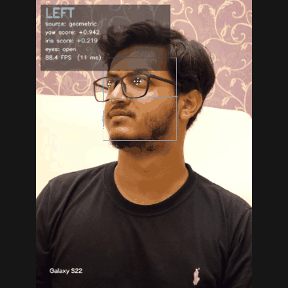
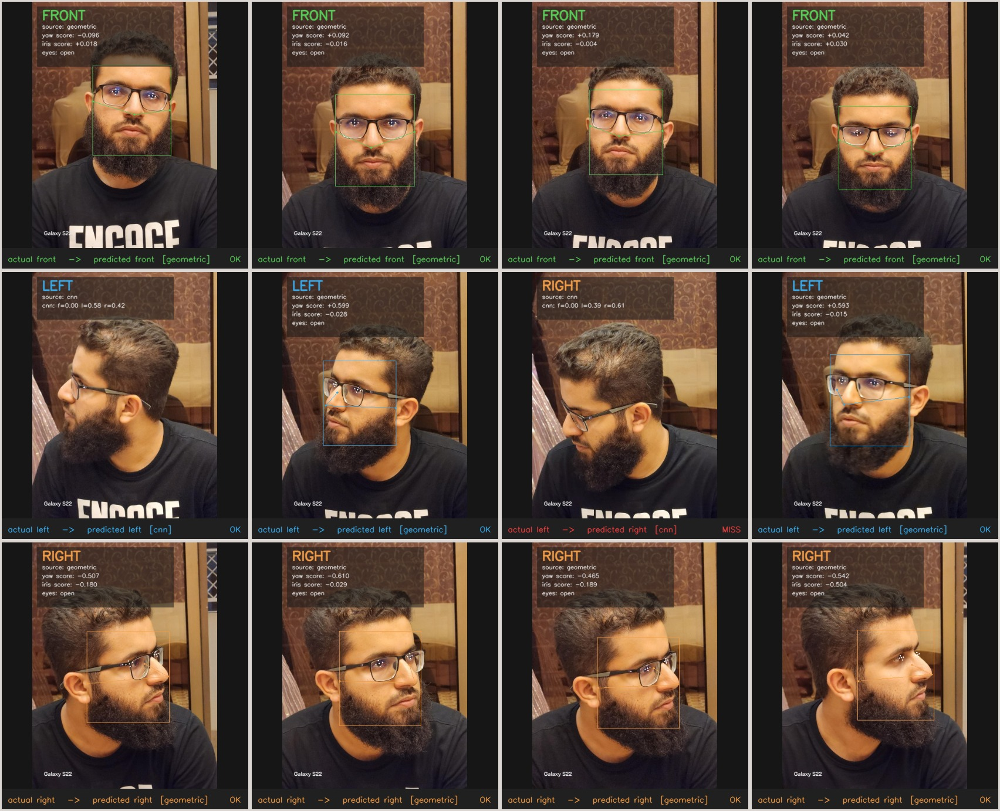
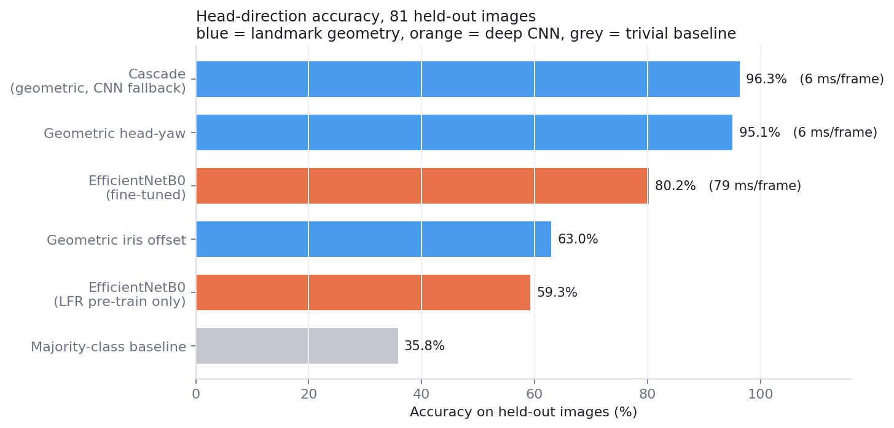
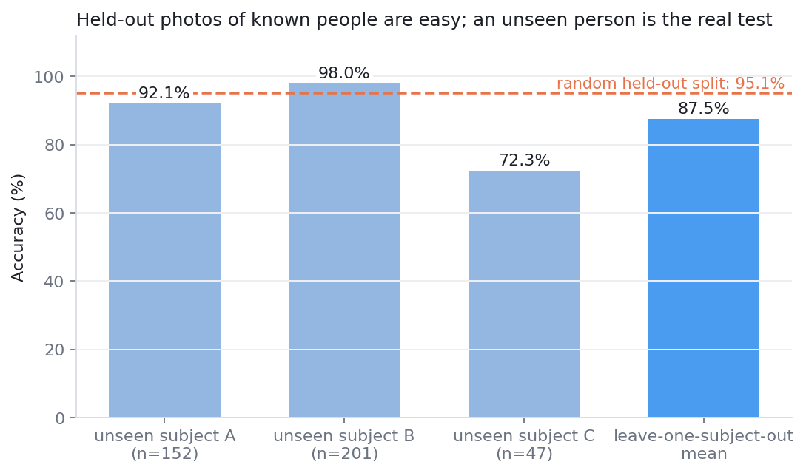
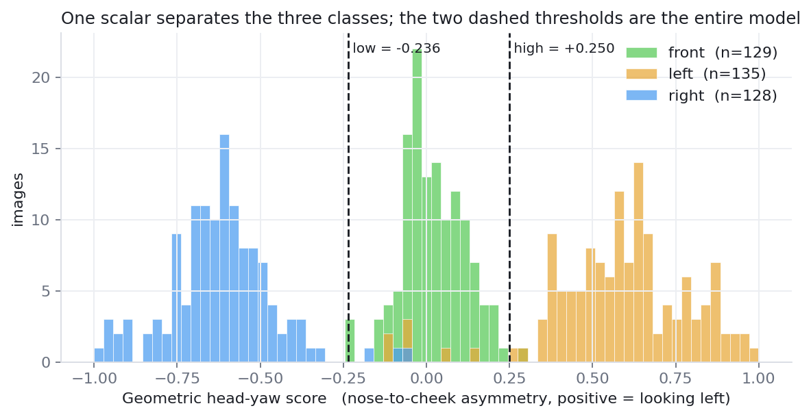
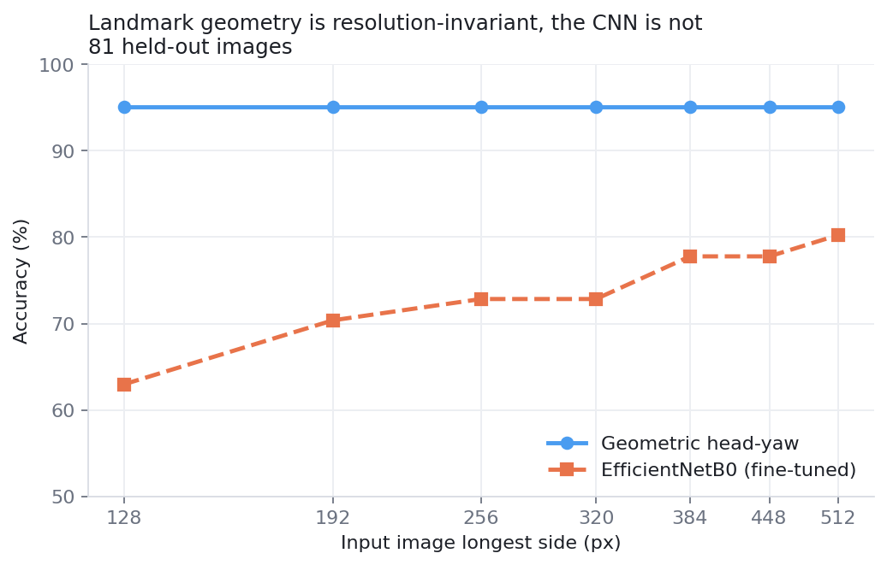
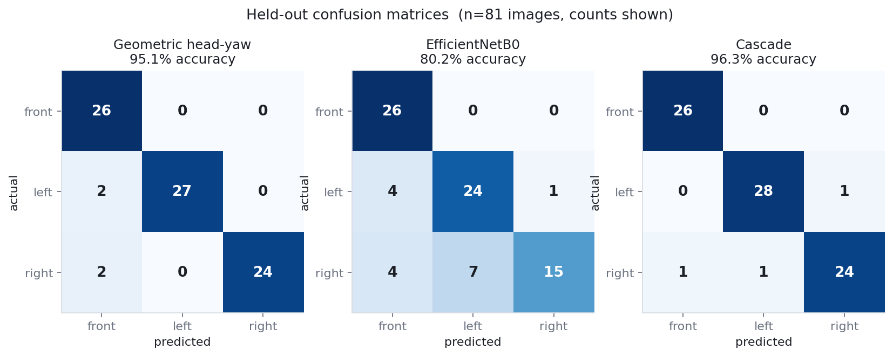
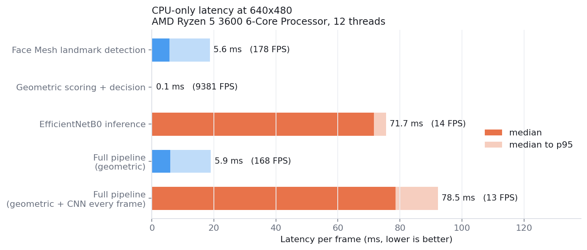

# Gaze Detection for Online Assessments and Driver Monitoring

Real-time classification of where a person is looking — **front**, **left** or **right** —
from a single webcam, running at **168 FPS on a CPU** with no GPU required.

Built as a Deep Learning for Perception course project, then rebuilt as a reproducible
study. Along the way the deep model we had trained turned out to be the *weaker* of the two
approaches we could build from the same data, and the repository now documents that
honestly rather than hiding it.

<p align="center">
  
</p>

<sub>The **video** pipeline — the same code path as `python scripts/run_video.py` — with
per-frame latency, iris and nose-to-cheek landmarks, majority-vote smoothing and the dwell
alert that fires once gaze has stayed off-centre. To be clear about what this is: these are
held-out photographs ordered by their own yaw score so they play as one continuous sweep, not
a webcam recording. Point the same script at your own camera and you get exactly this
overlay.</sub>



<sub>Twelve held-out photographs, one row per class, annotated by the shipped pipeline in
its default configuration. Each panel shows the verdict, the geometric score behind it,
and which branch produced it. Eleven of twelve are correct; the one labelled `MISS` is an
extreme profile where Face Mesh found no face at all and the CNN fallback guessed wrong.
It is left in deliberately.</sub>

---

## Headline result

On this dataset a **two-parameter geometric estimator built on MediaPipe Face Mesh
landmarks beats our fine-tuned EfficientNetB0 by 15 accuracy points while running 13×
faster**. Both were fitted on the same 319 training images and scored on the same 81
held-out images, so the comparison is symmetric.



| Method | Trainable parameters | Held-out accuracy | Latency / frame |
| --- | --- | --- | --- |
| Cascade: geometry first, CNN fallback | 2 + 4.05 M | 96.30% | 5.9 ms (168 FPS) |
| **Geometric head-yaw (Face Mesh landmarks)** | **2** | **95.06%** | **5.9 ms (168 FPS)** |
| EfficientNetB0, fine-tuned on our data | 4.05 M | 80.25% | 78.5 ms (13 FPS) |
| Geometric iris offset (eye-in-socket only) | 2 | 62.96% | 5.9 ms (168 FPS) |
| EfficientNetB0, LFR pre-training only | 4.05 M | 59.26% | 78.5 ms (13 FPS) |
| Majority-class baseline | 0 | 35.80% | — |

Measured on 81 held-out images (the `val` and `test` folders, which no threshold and no
gradient step ever saw) and on an AMD Ryzen 5 3600, CPU only, 640×480 input.
Regenerate every row with `python scripts/evaluate.py && python scripts/benchmark.py`.

**The cascade's lead is one frame** — 78 correct versus 77 out of 81 — so it is not a real
accuracy gain at this sample size, and the row is not bolded. Its actual value is coverage:
it answers on frames where Face Mesh finds no face, instead of returning `unknown`. The
result this project stands behind is the two-parameter geometric estimator, cross-validated
at **94.75% ± 1.66%** over all 400 images.

Digging one level further: of the geometric estimator's 4 errors, 3 are frames where Face
Mesh detected no face at all, so the score defaults to zero and lands in the `front` band.
**On the 78 images where a face is found it is right 77 times (98.72%)**, and the single
scoring error is a shallow turn that failed to cross a threshold. It never once confuses
`left` with `right`: all four errors report `front` when the truth is a turn, which for
proctoring is the benign direction — a missed glance rather than a false accusation.

### The honest number

The table above uses a *random* train/val/test split, so it measures "new photos of people
the system already knows". For a system meant to watch a stranger, that is the easy
question. Holding out an entire **unseen subject** instead:



**87.5% ± 11.0% leave-one-subject-out**, and only **72.3%** on the subject captured with a
different phone in a different room. That is the number to judge this project by, and it
matches what the original course report already suspected. With three subjects, this
system is a working prototype, not a deployable proctoring product.

---

## Why geometry wins here

Turning your head shortens the distance from your nose to the cheek you turn towards and
lengthens the distance to the other. Normalising that difference gives a single scalar that
is invariant to scale, image resolution and skin tone:

```
yaw_score = ( d(nose, right_cheek) − d(nose, left_cheek) )
            / ( d(nose, right_cheek) + d(nose, left_cheek) )
```

with MediaPipe landmark 1 for the nose tip and 234 / 454 for the cheek boundaries. The
entire "model" is two thresholds on this scalar, fitted on the training split:



The three classes form three nearly disjoint modes. A 4-million-parameter CNN trained on
319 photographs cannot beat that, because it has to *discover* this geometry from pixels
while also being tempted by shortcuts — background, wall pattern, shirt colour, lighting.
MediaPipe's landmark model already encodes the geometry, having been trained on far more
faces than we could ever collect.

The same reasoning predicts a second difference, which we then measured: relative landmark
positions survive heavy downsampling, while fine appearance detail does not.



The geometric estimator is flat at 95.06% from 512 px down to 128 px. The CNN falls from
80.25% to 62.96% over the same range.

---

## Quickstart

```bash
git clone https://github.com/anasahmed81103/Gaze-Detection-AI.git
cd Gaze-Detection-AI
pip install -r requirements.txt
python scripts/run_video.py                 # live webcam demo
```

Weights and calibration are committed, so there is nothing to download and nothing to train.
`python scripts/self_check.py` confirms the install in about ten seconds.

Three more things you can run immediately, no training and no downloads:

```bash
# Your own photo, or a folder of them
python scripts/run_image.py --source path/to/photo.jpg --show

# A video file, written out annotated
python scripts/run_video.py --source clip.mp4 --save results/clip_annotated.mp4

# Reproduce every number in this README
python scripts/evaluate.py && python scripts/benchmark.py
```

`run_video.py` defaults to the geometric path. Add `--with-cnn` to load EfficientNetB0 as a
fallback for frames where no face is found, and `--mirror` if you want `left` to mean *your*
left rather than the left side of the image.

### Use it as a library

```python
import cv2
from gaze import GazePipeline

with GazePipeline(use_cnn=False) as pipeline:
    result = pipeline.process(cv2.imread("photo.jpg"))
    print(result.label_name)          # 'front' | 'left' | 'right' | 'unknown'
    print(result.source)              # which branch decided
    print(result.features.yaw_score)  # the scalar behind the decision
```

`label_name` is `'unknown'` when no face can be found and no fallback is enabled. A
monitoring system needs to tell "looking at the screen" apart from "cannot tell", so the
pipeline never silently reports `front` in that case.

---

## How it works

```
frame
  │
  ├─► MediaPipe Face Mesh (478 landmarks, refine_landmarks=True)      98.0% of frames
  │     │
  │     ├─► head-yaw score ──► two calibrated thresholds ──► VERDICT   95.06%
  │     ├─► iris offset  ────► eye-in-socket direction (auxiliary)     62.96%
  │     └─► eye-aspect-ratio ► blink / eye closure (not benchmarked)
  │
  └─► no landmarks?  ─► EfficientNetB0 on the whole frame ─► VERDICT    2.0% of frames
                                                                        ↓
                                       majority vote over 7 frames + dwell timer → alert
```

Face Mesh finds a face in 98.0% of our photographs. The CNN exists to cover the remaining
2% — extreme profiles where the landmark model gives up but a whole-frame classifier can
still guess. On the held-out set that means 3 frames: the CNN gets 1 right and 2 wrong,
which is the entire difference between 95.06% and 96.30%.



Both methods find `front` easy. The CNN's weakness is `right`, which it confuses with
`left` seven times out of 26 — a semantic error the geometric method structurally cannot
make. Geometry's own four errors all land in the `front` column.

For video there is a majority vote over a short window, so a single dropped detection
cannot flip the verdict, plus a dwell timer that only raises an alert once gaze has stayed
away from centre for longer than `--dwell` seconds. A glance away is normal; a sustained
one is the signal.



---

## Engineering notes

| | |
| --- | --- |
| Framework | TensorFlow 2.19 / Keras 3.9, MediaPipe 0.10.21, OpenCV 4.11 |
| Inference hardware | CPU only, AMD Ryzen 5 3600 (12 threads). No GPU used or required |
| Latency, geometric path | 5.9 ms median, 19.0 ms p95 → 168 FPS at 640×480 |
| Latency, with CNN every frame | 78.5 ms median → 13 FPS |
| End-to-end video throughput | ~100 FPS including decode and overlay |
| Model size shipped | 2 floats + 16.3 MB Keras graph (4.05 M parameters) |
| Precision | FP32 throughout; the geometric path is not the bottleneck, so quantisation was not pursued |
| Startup cost | ~1 s geometric, ~4 s with the CNN graph loaded |

Three decisions worth calling out, each made by measuring rather than guessing:

- **Whole frames, not face crops.** The CNN was trained on full photographs, so cropping to
  the detected face at inference time costs 6.2 points (80.25% → 74.07%). Tempting, wrong.
- **Two thresholds, not one.** `front` is not symmetric around zero in our data, so a single
  magnitude threshold underperforms an asymmetric pair.
- **Undetected ≠ front.** See `label_name == 'unknown'` above.

---

## What did not work

Negative results, kept because they cost real time and shape what to try next.

| Attempt | Outcome | Why |
| --- | --- | --- |
| EfficientNetB0 on the LFR face dataset alone (98 505 images, 10 + 6 epochs) | 73.7% on LFR val, **59.26%** on our photos | Large public set, wrong domain: mostly frontal, different capture conditions |
| Custom 16.9 M-parameter CNN (`face_direction_model2.h5`) | **54.5%** at best, below the 2-parameter geometric method | Trained from scratch on too little data; five times the parameters of EfficientNetB0 for worse results |
| 8-class eye-region CNN (`eyes_dir_model.h5`) mapped onto 3 classes | **46.0%**, near chance | Trained on cropped single-eye images from a different distribution; softmax was near-uniform on our eye crops |
| EfficientNetB3 at 300×300 | Abandoned | ~2 s per training step on available hardware, no path to convergence in the time we had |
| Iris offset as the primary signal | 62.96% | Real signal, but eye-in-socket movement is small and noisy next to head rotation |

The custom-CNN result came with a bug worth documenting: the original inference notebook
declared its classes as `['left', 'right', 'front']` and fed OpenCV's native BGR channel
order, while the model had been trained on RGB with the alphabetical order Keras assigns
(`['front', 'left', 'right']`). It scored *below* chance. Correcting both lifted it to 54.5%.
The hand-tuned threshold rules in `notebooks/legacy/final_predictor.ipynb` were, in
hindsight, compensating for that mislabelling.

---

## Repository layout

```
gaze/                  importable package: detection, geometry, CNN, smoothing, overlay
  config.py            paths, class order, MediaPipe landmark indices
  landmarks.py         Face Mesh with Haar cascade fallback
  geometric.py         yaw / iris / EAR scores and calibrated thresholds
  cnn.py               EfficientNetB0 wrapper with the correct preprocessing
  pipeline.py          the cascade, returning a fully-attributed GazeResult
  smoothing.py         majority vote and dwell-time alerting
  viz.py               overlay rendering
scripts/
  run_image.py         inference on an image or folder
  run_video.py         inference on a webcam or video file
  calibrate_geometric.py   fit the two thresholds, write models/geometric_calibration.json
  evaluate.py          the comparison table and confusion matrices
  cross_subject_eval.py    leave-one-subject-out generalisation
  resolution_sweep.py  accuracy against input resolution
  benchmark.py         per-stage CPU latency
  make_assets.py       regenerate every figure in this README
  self_check.py        verify a fresh checkout before trusting its output
models/                shipped weights and the threshold calibration
data/                  the 400 photographs we captured and labelled
docs/                  original course report (PDF) plus the extended write-up
notebooks/legacy/      the original exploration notebooks, unmodified
results/               JSON produced by the scripts; the README quotes these files
```

Everything in this README is generated by the scripts above. To rebuild from scratch:

```bash
python scripts/calibrate_geometric.py
python scripts/evaluate.py
python scripts/cross_subject_eval.py
python scripts/resolution_sweep.py
python scripts/benchmark.py
python scripts/make_assets.py
```

---

## Data

`data/personal_data_small/` holds **400 labelled photographs of 3 consenting subjects**
(319 train / 40 val / 41 test), captured on two phones in three rooms, balanced across the
three classes. Images are downscaled to 512 px on the longest side, which keeps the
repository small and — as the resolution study shows — costs the geometric method nothing.

Labels are defined **in image space**: `left` means the face is turned towards the left edge
of the frame. See [`data/README.md`](data/README.md) for the capture protocol, the subject
grouping and the public datasets used during training but not redistributed here.

---

## Limitations

Stated plainly, because they determine whether this is useful to you:

- **Three subjects.** All young adult males, two of three wearing glasses. Nothing here
  establishes fairness across age, gender, ethnicity or eyewear.
- **72.3% on the hardest unseen subject.** Cross-subject accuracy is 87.5% ± 11.0%, well
  below the 96.3% headline. The thresholds are the part that fails to transfer.
- **Three coarse classes.** This is head-direction classification, not gaze-point
  regression. It cannot tell you *where* on a screen someone is looking.
- **Head pose dominates.** The iris signal that would separate "head forward, eyes sideways"
  is the weakest component at 62.96%. Someone who moves only their eyes will often read as
  `front`.
- **Frontal, reasonably lit faces.** Face Mesh reaches 98.0% detection on our data; extreme
  profiles fall through to the CNN, which is where most remaining errors live.
- **The blink signal is not benchmarked.** The eye-aspect-ratio threshold is derived from
  the open-eye distribution because we hold no labelled closed-eye split.
- **Not a cheating detector.** It reports where a head is pointed. Any inference about
  academic dishonesty is a human judgement with a false-positive cost, and this repository
  makes no claim to support it.

Next steps that would actually move the numbers: more subjects before more parameters;
per-user threshold calibration from a few seconds of frontal video; and a proper
leave-one-subject-out re-training of the CNN so both methods are measured under the harder
protocol.

---

## Documentation

- [`docs/REPORT.md`](docs/REPORT.md) — extended write-up: method, protocol, full ablations, error analysis
- [`docs/MODEL_CARD.md`](docs/MODEL_CARD.md) — intended use, out-of-scope use, per-class metrics
- [`docs/DLP_Report_Final.pdf`](docs/DLP_Report_Final.pdf) — the original course report, as submitted
- [`notebooks/README.md`](notebooks/README.md) — what each original notebook did and what came of it

## Author

Anas Ahmed (22K-4154). Course project for Deep Learning for Perception, instructor
Dr. Farrukh Hasan Syed. The reproducibility work, the geometric estimator and the
evaluation protocols in this repository were added after submission.

## Acknowledgements

MediaPipe Face Mesh (Google) for the landmark model that does the heavy lifting;
EfficientNet (Tan & Le, 2019) for the CNN backbone; the Kaggle and LFR datasets listed in
`data/README.md` for pre-training material. [Hopenet](https://github.com/natanielruiz/deep-head-pose)
was evaluated as a head-pose reference during development but is not part of this pipeline.

## License

[MIT](LICENSE) for the code. The photographs in `data/` are shared for research and
educational use; please do not redistribute them separately or use them to train commercial
biometric systems.
